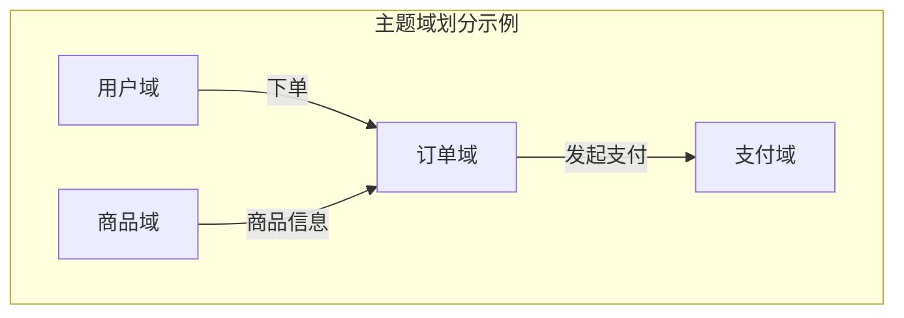
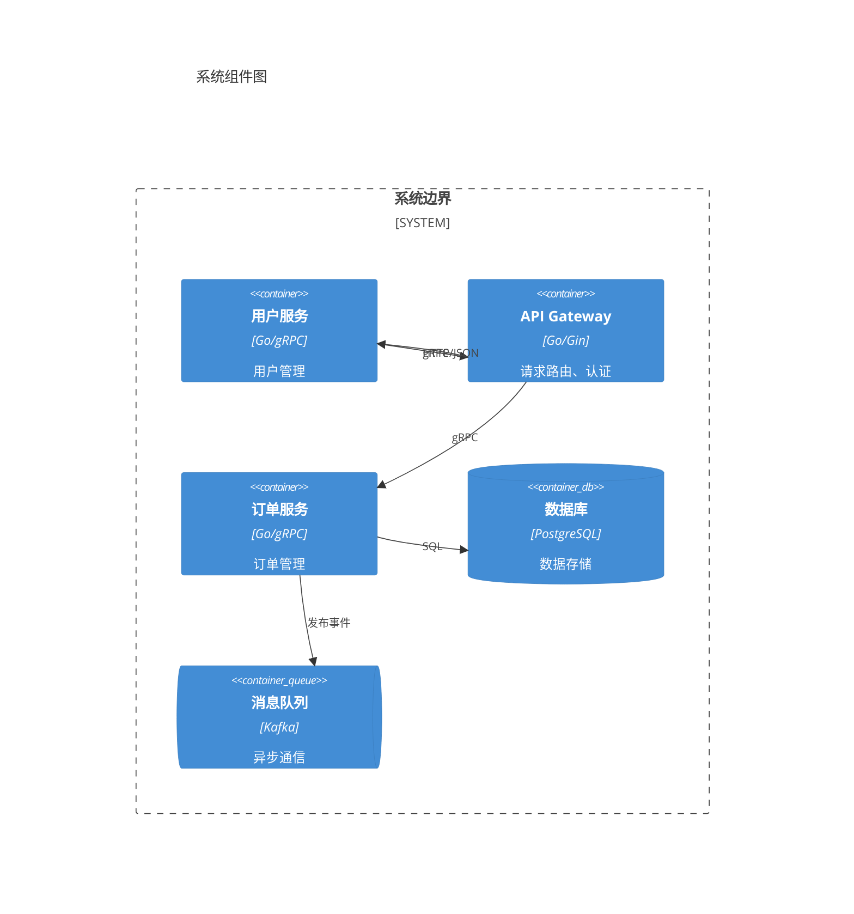
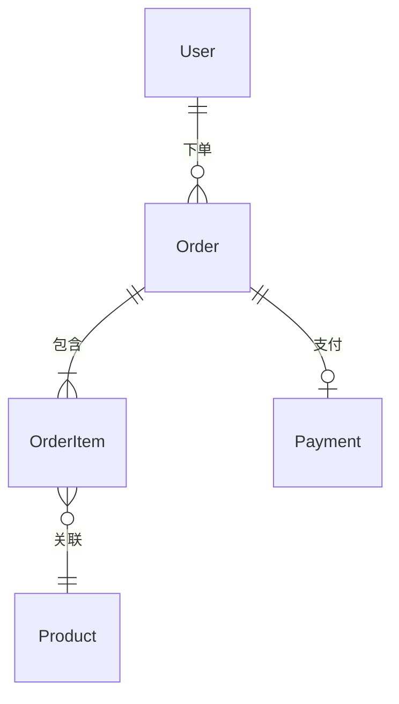
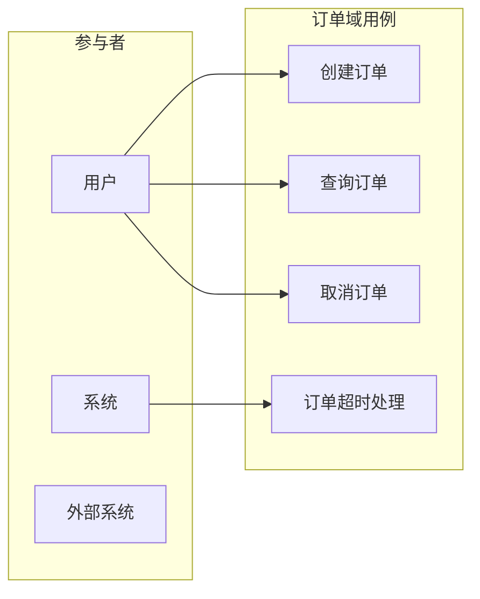
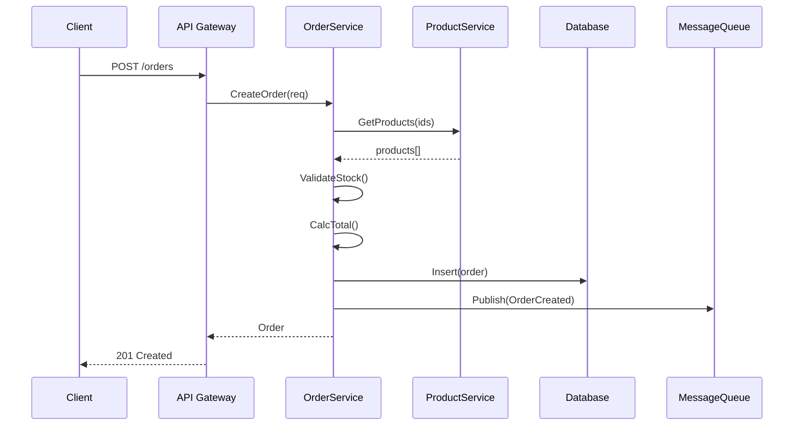

# 系统设计（7步法 + SERU融合）

基于系统设计7步法，融合SERU分析方法论，系统化完成从需求到设计的全流程。

## 流程概述

```
Step1: 明确需求 → Step2: 定义规模 → Step3: 勾勒架构 → Step4: 定义数据 → Step5: 设计接口 → Step6: 规划扩展 → Step7: 总结输出
```

**7步法 + SERU融合**：
1. **Step 1**：项目背景、主题域划分、业务事件识别（SERU-S/E/R）
2. **Step 2**：性能需求、数据规模、技术约束
3. **Step 3**：代码库分析、组件划分、架构决策（ADR）
4. **Step 4**：实体识别、关系建模、数据所有权
5. **Step 5**：用例建模（SERU-U）、接口签名、核心流程
6. **Step 6**：扩展点识别、集成策略、降级方案
7. **Step 7**：完整性检查、权衡总结、生成设计文档

**方法论参考**：[references/overview.md](references/overview.md)

---

## 前置准备

与用户确认以下信息：

| 参数 | 说明 | 默认值 |
|------|------|--------|
| `project_name` | 项目名称 | 必填 |
| `project_background` | 项目背景和启动原因 | 必填 |
| `project_path` | 现有代码库路径（增量设计时必填） | 可选 |
| `design_depth` | 设计深度：quick/standard/comprehensive | standard |
| `output_dir` | 设计文档输出目录 | ./design/ |

**设计深度说明**：
- `quick`：快速设计，适合小型功能，仅设计核心接口（3-5个）
- `standard`：标准设计，适合中型功能，设计核心和重要接口（10-15个）
- `comprehensive`：全面设计，适合大型系统，设计所有接口

询问用户是否已有需求材料（需求文档、PRD、技术方案等），如有则先阅读理解。

**输出规范**：
- 产出的设计文档中，所有图表必须使用Mermaid格式
- 接口签名使用Markdown表格格式

---

## 交互原则

**歧义澄清**：每个步骤执行过程中，遇到以下情况必须暂停并向用户提问澄清，不得自行假设：

| 歧义类型 | 说明 | 示例 |
|----------|------|------|
| 业务语义不明 | 术语含义、业务规则不确定 | "VIP用户"的判定标准是什么？ |
| 边界模糊 | 功能范围、职责划分有多种合理解读 | 退款流程是否包含部分退款？ |
| 技术选型有争议 | 存在多个可行方案且各有利弊 | 服务间通信用gRPC还是HTTP？ |
| 隐含需求 | 用户未明确提及但可能存在的需求 | 订单是否需要支持草稿状态？ |
| 约束冲突 | 不同需求之间存在矛盾 | 高一致性要求与低延迟要求的冲突 |

**澄清流程**：
1. 标记歧义点：明确指出哪里存在歧义
2. 列出可能的解读或方案（至少2个）
3. 给出推荐选项及理由（如果有倾向）
4. 等待用户回复后再继续

**阶段门禁**：每个Step结束时必须将该阶段产出完整展示给用户，经用户确认无误后才能进入下一Step。用户可以要求修改，修改完成后需再次确认。

---

## Step 1: 明确需求（Clarify Requirements）

> 方法论：SERU-S/E/R | 参考：[references/seru/subject-area.md](references/seru/subject-area.md)

**目标**：明确系统边界、业务事件和关键输出

### Step 1.1: 项目背景确认

**操作流程**：
1. 与用户确认项目目标和启动原因
2. 明确成功标准和验收条件
3. 确认项目范围边界（做什么/不做什么）

**输出**：项目概述（目标、范围、成功标准）

---

### Step 1.2: 主题域划分（SERU-S）

**目标**：按业务职责将系统划分为多个主题域

**操作流程**：
1. 与用户讨论系统涉及的主要业务领域
2. 按职责划分主题域（建议3-8个）
3. 为每个主题域定义：名称、描述、核心职责
4. 梳理主题域之间的关系

**输出**：
- 主题域清单（Markdown表格）
- 主题域关系图（Mermaid）



**参考**：[references/seru/subject-area.md](references/seru/subject-area.md)

---

### Step 1.3: 业务事件识别（SERU-E）

**目标**：识别触发系统响应的业务事件

**操作流程**：
1. 询问用户：哪些外部事件会触发系统操作？
2. 事件分类：
   - **外部事件**：用户操作、外部系统调用
   - **时间事件**：定时任务、批处理
   - **状态事件**：状态变更触发
3. 为每个事件记录：事件名称、触发者、频率、重要性
4. 按主题域归类事件

**输出**：业务事件清单（按主题域组织）

| 主题域 | 事件名称 | 触发者 | 类型 | 频率 |
|--------|----------|--------|------|------|
| 订单域 | 创建订单 | 用户 | 外部 | 高 |
| 订单域 | 订单超时取消 | 系统 | 时间 | 中 |

**参考**：[references/seru/event-report.md](references/seru/event-report.md)

---

### Step 1.4: 报表与管控点识别（SERU-R）

**目标**：识别系统输出的关键报表和监控指标

**操作流程**：
1. 询问用户：系统需要输出哪些报表或监控指标？
2. 为每个报表记录：名称、用途、使用者、更新频率
3. 识别管控点（需要监控和控制的业务节点）

**输出**：报表和管控点清单

**参考**：[references/seru/control-point.md](references/seru/control-point.md)

---

### Step 1.5: 歧义澄清与阶段确认

**典型歧义点**（执行1.1-1.4过程中遇到以下情况须立即向用户提问）：
- 某个业务术语有多种理解（如"订单完成"是指发货还是签收？）
- 主题域之间的职责边界不清晰（如退款属于订单域还是支付域？）
- 事件的触发条件或业务规则不明确（如"库存不足"的阈值是什么？）
- 用户提到的需求可能隐含未说明的子需求

使用检查清单 [assets/checklists/step1-checklist.md](assets/checklists/step1-checklist.md) 验证：
- [ ] 项目目标和范围清晰
- [ ] 主题域划分合理且无遗漏
- [ ] 主要业务事件已识别
- [ ] 关键报表和管控点已确定
- [ ] 所有歧义点已澄清

**[阶段门禁]**：将以上产出完整展示给用户，等待用户确认。用户确认无误后才可进入 Step 2。如用户要求修改，修改后需再次确认。

---

## Step 2: 定义规模（Define Scale）

> 参考：[references/mainlines/quality-requirements.md](references/mainlines/quality-requirements.md)

**目标**：明确系统的规模约束和质量要求

### Step 2.1: 性能需求

与用户讨论以下指标：

| 指标 | 说明 | 示例 |
|------|------|------|
| 响应时间 | API响应延迟要求 | p99 < 200ms |
| 吞吐量 | 每秒请求数 | 1000 QPS |
| 并发量 | 同时在线用户数 | 10000 |

---

### Step 2.2: 数据规模

| 指标 | 说明 | 示例 |
|------|------|------|
| 数据量 | 核心数据总量 | 100万用户 |
| 增长率 | 数据增长速度 | 日增10GB |
| 存储需求 | 存储空间估算 | 1TB/年 |

---

### Step 2.3: 可用性要求

| 指标 | 说明 | 示例 |
|------|------|------|
| SLA | 服务可用性目标 | 99.9% |
| RTO | 恢复时间目标 | < 1小时 |
| RPO | 数据恢复点目标 | < 5分钟 |

---

### Step 2.4: 技术约束

| 约束类型 | 内容 |
|----------|------|
| 语言/框架 | Go 1.21, Gin, gRPC |
| 基础设施 | Kubernetes, PostgreSQL, Redis |
| 现有系统 | 需对接XX系统API |

---

### Step 2.5: 组织约束

| 约束类型 | 内容 |
|----------|------|
| 团队规模 | 3人后端开发 |
| 技能栈 | 熟悉Go、K8s |
| 时间约束 | 2个迭代完成 |

---

### Step 2.6: 歧义澄清与阶段确认

**典型歧义点**（执行2.1-2.5过程中遇到以下情况须立即向用户提问）：
- 性能指标不明确（如"快速响应"具体要求多少毫秒？）
- 数据规模难以估算（需要用户提供业务增长预期）
- 可用性要求与成本约束之间存在矛盾
- 技术选型存在多个可行方案

使用检查清单 [assets/checklists/step2-checklist.md](assets/checklists/step2-checklist.md) 验证。

**[阶段门禁]**：将以上产出完整展示给用户，等待用户确认。用户确认无误后才可进入 Step 3。如用户要求修改，修改后需再次确认。

---

## Step 3: 勾勒架构（Outline Architecture）

> 参考：[references/system-design/c4-model.md](references/system-design/c4-model.md)

**目标**：设计高层架构，与现有系统对齐

### Step 3.1: 现有代码库分析

**前提**：用户提供了 `project_path`

**操作流程**：
1. 扫描代码库目录结构
2. 识别技术栈（语言、框架、依赖）
3. 识别分层架构（Controller/Service/Repository等）
4. 识别现有模块划分

**输出**：使用模板 [assets/templates/codebase-analysis.md](assets/templates/codebase-analysis.md)

---

### Step 3.2: 架构对齐

确认新设计与现有架构风格一致：
- 分层方式
- 命名规范
- 目录组织
- 依赖注入方式

---

### Step 3.3: 组件划分

基于主题域（Step 1.2）划分组件：



---

### Step 3.4: 通信机制决策

| 场景 | 机制 | 说明 |
|------|------|------|
| 同步调用 | gRPC/HTTP | 需要立即响应 |
| 异步解耦 | 消息队列 | 解耦、削峰 |
| 数据同步 | Event Sourcing | 跨服务数据一致性 |

---

### Step 3.5: 架构决策记录（ADR）

使用模板 [assets/templates/architecture-decision.md](assets/templates/architecture-decision.md) 记录关键决策。

---

### Step 3.6: 歧义澄清与阶段确认

**典型歧义点**（执行3.1-3.5过程中遇到以下情况须立即向用户提问）：
- 现有代码中的设计意图不明确（如某个模块的职责是否应扩展？）
- 新组件与现有架构风格的对齐方式有多种选择
- 同步/异步通信机制的选择存在争议
- 架构决策涉及重大取舍需要用户拍板

使用检查清单 [assets/checklists/step3-checklist.md](assets/checklists/step3-checklist.md) 验证。

**[阶段门禁]**：将以上产出完整展示给用户，等待用户确认。用户确认无误后才可进入 Step 4。如用户要求修改，修改后需再次确认。

---

## Step 4: 定义数据模型（Define Data Models）

> 参考：[references/mainlines/data-requirements.md](references/mainlines/data-requirements.md)

**目标**：建立领域概念模型，明确数据所有权

### Step 4.1: 实体识别

从业务事件（Step 1.3）和报表（Step 1.4）中提取名词，识别候选实体。

**建议**：核心实体控制在10-30个

---

### Step 4.2: 实体映射（增量设计）

与现有代码对比：

| 需求实体 | 现有类名 | 文件路径 | 状态 |
|----------|----------|----------|------|
| User | UserEntity | model/user.go | 已存在 |
| Order | - | - | 需新增 |
| Product | ProductModel | model/product.go | 需修改 |

---

### Step 4.3: 属性定义

为每个实体定义核心属性（3-5个）：

| 实体 | 属性 | 类型 | 说明 |
|------|------|------|------|
| Order | id | string | 订单ID |
| Order | userId | string | 用户ID |
| Order | status | enum | 订单状态 |
| Order | totalAmount | decimal | 总金额 |

---

### Step 4.4: 关系建模

使用Mermaid ER图：



---

### Step 4.5: 数据所有权

确定每个实体的唯一写入者（服务）：

| 实体 | 所有者服务 | 读取者 |
|------|-----------|--------|
| User | 用户服务 | 订单服务、支付服务 |
| Order | 订单服务 | 支付服务、报表服务 |

---

### Step 4.6: 歧义澄清与阶段确认

**典型歧义点**（执行4.1-4.5过程中遇到以下情况须立即向用户提问）：
- 实体的业务含义有多种理解（如"账户"是指用户账号还是资金账户？）
- 实体之间的关系类型不确定（如订单与优惠券是1:1还是1:N？）
- 现有实体的修改范围不明确（新增字段还是重构？）
- 数据所有权的归属有争议（跨服务数据该由谁写入？）

使用检查清单 [assets/checklists/step4-checklist.md](assets/checklists/step4-checklist.md) 验证。

**输出**：使用模板 [assets/templates/domain-model.md](assets/templates/domain-model.md)

**[阶段门禁]**：将以上产出完整展示给用户，等待用户确认。用户确认无误后才可进入 Step 5。如用户要求修改，修改后需再次确认。

---

## Step 5: 设计组件与接口（Design Components/APIs）

> 方法论：SERU-U | 参考：[references/seru/usecase.md](references/seru/usecase.md)

**目标**：设计类/函数级别的具体接口

### Step 5.1: 用例建模（SERU-U）

从业务事件（Step 1.3）转化为用例：



**参考**：[references/seru/usecase.md](references/seru/usecase.md)

---

### Step 5.2: 用例细化

根据 `design_depth` 选择细化深度，使用模板 [assets/templates/usecase.md](assets/templates/usecase.md)：

- `quick`：仅细化核心用例（3-5个）
- `standard`：细化核心和重要用例（10-15个）
- `comprehensive`：细化所有用例

---

### Step 5.3: 服务接口设计

**接口签名格式**：

**类名**: `OrderService` | **类型**: Interface | **模块**: `order/service`

| 方法 | 描述 | 参数 | 返回 | 异常 | 幂等 |
|------|------|------|------|------|------|
| `CreateOrder` | 创建订单 | `req: CreateOrderReq` | `*Order, error` | `ValidationError` | 否 |
| `GetOrder` | 查询订单 | `id: string` | `*Order, error` | `NotFoundError` | 是 |
| `CancelOrder` | 取消订单 | `id, reason: string` | `error` | `StateError` | 是 |

**输出**：使用模板 [assets/templates/interface-design.md](assets/templates/interface-design.md)

---

### Step 5.4: 实体类设计

| 类名 | 属性 | 方法 |
|------|------|------|
| `Order` | id, userId, status, items, totalAmount, createdAt | `CanCancel() bool`, `CalcTotal()` |

---

### Step 5.5: DTO设计

| DTO | 用途 | 字段 |
|-----|------|------|
| `CreateOrderReq` | 创建订单请求 | userId, items[], couponCode |
| `CreateOrderResp` | 创建订单响应 | orderId, totalAmount |
| `OrderDTO` | 订单详情 | id, status, items, amount, createdAt |

---

### Step 5.6: 核心流程设计

使用Mermaid序列图：



---

### Step 5.7: 歧义澄清与阶段确认

**典型歧义点**（执行5.1-5.6过程中遇到以下情况须立即向用户提问）：
- 用例的前置条件或后置条件不明确
- 接口的参数设计有多种合理方案（如批量操作还是单条操作？）
- 异常处理策略不明确（如库存不足时是拒绝还是预约？）
- 核心流程的步骤顺序或分支逻辑有歧义

使用检查清单 [assets/checklists/step5-checklist.md](assets/checklists/step5-checklist.md) 验证。

**[阶段门禁]**：将以上产出完整展示给用户，等待用户确认。用户确认无误后才可进入 Step 6。如用户要求修改，修改后需再次确认。

---

## Step 6: 规划扩展（Plan Scaling）

**目标**：识别扩展点，规划与现有系统的集成

### Step 6.1: 扩展点识别

分析现有代码中的扩展机制：

| 扩展点 | 类型 | 位置 | 用途 |
|--------|------|------|------|
| `PaymentStrategy` | Interface | payment/strategy.go | 支付方式扩展 |
| `OrderValidator` | Plugin | order/validator/ | 订单校验规则 |

---

### Step 6.2: 集成策略

| 集成点 | 策略 | 说明 |
|--------|------|------|
| 新增服务 | 组合 | 通过依赖注入集成 |
| 扩展现有功能 | 继承/实现接口 | 实现现有接口 |
| 数据迁移 | 适配器 | 兼容旧数据格式 |

---

### Step 6.3: 水平扩展策略

- 无状态设计：Session存储在Redis
- 负载均衡：Round Robin
- 数据库读写分离

---

### Step 6.4: 降级策略

| 功能 | 类型 | 降级方案 |
|------|------|----------|
| 订单创建 | 核心 | 不降级 |
| 推荐商品 | 可选 | 返回热门商品 |
| 订单统计 | 可选 | 返回缓存数据 |

---

### Step 6.5: 歧义澄清与阶段确认

**典型歧义点**（执行6.1-6.4过程中遇到以下情况须立即向用户提问）：
- 扩展点的粒度不确定（是预留接口还是插件机制？）
- 与现有系统的集成方式有多种选择
- 降级策略的优先级不明确（哪些功能可以降级？）
- 扩展方案的复杂度与当前需求是否匹配

使用检查清单 [assets/checklists/step6-checklist.md](assets/checklists/step6-checklist.md) 验证。

**[阶段门禁]**：将以上产出完整展示给用户，等待用户确认。用户确认无误后才可进入 Step 7。如用户要求修改，修改后需再次确认。

---

## Step 7: 总结与输出（Summarize Trade-offs）

**目标**：生成系统设计文档，提供实现指南

### Step 7.1: 设计完整性检查

使用检查清单 [assets/checklists/completeness-checklist.md](assets/checklists/completeness-checklist.md) 进行最终验证。

---

### Step 7.2: 权衡总结

记录设计中的关键权衡：

| 决策 | 选择 | 优点 | 缺点 | 风险 |
|------|------|------|------|------|
| 通信方式 | gRPC | 高性能、强类型 | 调试困难 | 低 |
| 数据库 | PostgreSQL | 事务支持好 | 扩展性一般 | 中 |

---

### Step 7.3: 实现指南

**新增文件**：
| 文件路径 | 说明 |
|----------|------|
| `service/order/order.go` | 订单服务实现 |
| `model/order.go` | 订单实体 |
| `api/order/handler.go` | API处理器 |

**修改文件**：
| 文件路径 | 修改内容 |
|----------|----------|
| `router/router.go` | 添加订单路由 |
| `config/config.go` | 添加订单配置 |

**实现顺序**：
1. 数据模型（model/）
2. 服务层（service/）
3. API层（api/）
4. 集成测试

---

### Step 7.4: 生成设计文档

整合所有输出，使用模板 [assets/templates/system-design-doc.md](assets/templates/system-design-doc.md) 生成完整设计文档。

输出到 `{{output_dir}}/system-design.md`

---

## 输出总结

```
系统设计完成报告
================
项目名称：{{project_name}}
设计深度：{{design_depth}}

统计信息：
- 划分主题域：X 个
- 识别业务事件：X 个
- 识别核心实体：X 个
- 设计服务接口：X 个
- 设计核心流程：X 个

输出文件：{{output_dir}}/system-design.md

建议后续步骤：
1. 与团队评审设计文档
2. 创建详细任务拆分
3. 开始编码实现
```
