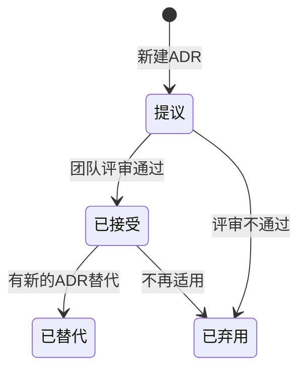

# 架构决策记录（ADR）

## ADR-{{id}}: {{title}}

| 属性 | 值 |
|------|-----|
| **状态** | 提议 / 已接受 / 已弃用 / 已替代 |
| **决策日期** | {{date}} |
| **决策者** | {{deciders}} |
| **关联ADR** | ADR-xxx（如有） |

---

### 背景（Context）

描述导致此决策的背景和问题：

- 当前面临什么问题？
- 有哪些约束条件？
- 为什么需要做出决策？

---

### 可选方案（Options）

#### 方案1: {{option1_name}}

**描述**：{{description}}

**优点**：
- 优点1
- 优点2

**缺点**：
- 缺点1
- 缺点2

**成本/复杂度**：低/中/高

---

#### 方案2: {{option2_name}}

**描述**：{{description}}

**优点**：
- 优点1
- 优点2

**缺点**：
- 缺点1
- 缺点2

**成本/复杂度**：低/中/高

---

#### 方案3: {{option3_name}}（如有）

...

---

### 决策（Decision）

**选择方案**：方案X - {{option_name}}

**决策理由**：

1. 理由1
2. 理由2
3. 理由3

---

### 影响（Consequences）

#### 正面影响

- 影响1
- 影响2

#### 负面影响

- 影响1
- 影响2

#### 风险

| 风险 | 可能性 | 影响 | 缓解措施 |
|------|--------|------|----------|
| 风险1 | 低/中/高 | 低/中/高 | |
| 风险2 | 低/中/高 | 低/中/高 | |

---

### 验证（Validation）

如何验证此决策是正确的：

- [ ] 验证点1
- [ ] 验证点2
- [ ] 性能测试
- [ ] 压力测试

---

### 参考资料（References）

- 参考链接1
- 参考链接2

---

## ADR模板使用说明

### 状态流转

### 最佳实践

1. **及时记录**：在做出决策时立即记录，而非事后补充
2. **简洁明了**：每个ADR聚焦一个决策
3. **承认缺点**：诚实列出所选方案的缺点和风险
4. **可追溯**：关联相关的ADR和需求
5. **定期回顾**：定期检查ADR是否仍然适用
