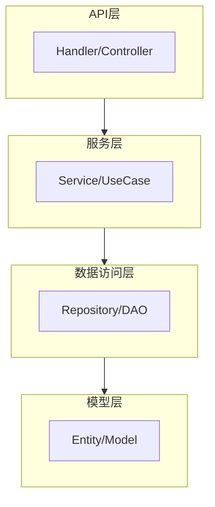
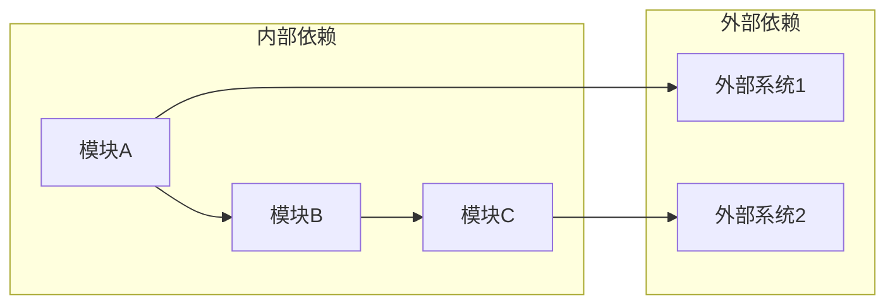

# 代码库分析报告

## 项目概况

| 属性 | 值 |
|------|-----|
| 项目路径 | `{{project_path}}` |
| 主要语言 | {{language}} |
| 框架版本 | {{framework}} |
| 分析日期 | {{date}} |

## 目录结构

```
{{project_path}}/
├── cmd/                    # 入口文件
├── internal/               # 内部模块
│   ├── api/               # API层
│   ├── service/           # 服务层
│   ├── repository/        # 数据访问层
│   └── model/             # 数据模型
├── pkg/                    # 公共包
├── config/                 # 配置文件
└── ...
```

## 技术栈

| 类型 | 技术 | 版本 | 说明 |
|------|------|------|------|
| 语言 | | | |
| Web框架 | | | |
| ORM | | | |
| 数据库 | | | |
| 缓存 | | | |
| 消息队列 | | | |
| 其他 | | | |

## 分层架构



## 现有模块

| 模块 | 路径 | 职责 | 状态 |
|------|------|------|------|
| | | | |

## 现有实体映射

| 需求实体 | 现有类名 | 文件路径 | 状态 |
|----------|----------|----------|------|
| | | | 已存在 |
| | | | 需新增 |
| | | | 需修改 |

**状态说明**：
- **已存在**：现有代码中已有对应实体，可直接使用
- **需新增**：现有代码中没有，需要新建
- **需修改**：现有实体需要修改属性或方法

## 扩展点清单

| 扩展点 | 类型 | 位置 | 用途 |
|--------|------|------|------|
| | Interface | | |
| | Abstract Class | | |
| | Strategy | | |
| | Plugin | | |

## 依赖关系



## 代码规范

| 规范项 | 现有做法 |
|--------|----------|
| 命名规范 | |
| 目录组织 | |
| 错误处理 | |
| 日志规范 | |
| 测试规范 | |

## 需要关注的点

- [ ] 待确认项1
- [ ] 待确认项2
- [ ] 潜在风险点
