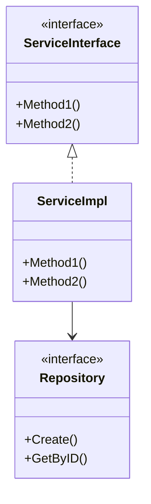

# 接口设计文档

## 概述

| 属性 | 值 |
|------|-----|
| 项目名称 | {{project_name}} |
| 设计日期 | {{date}} |
| 设计深度 | {{design_depth}} |

---

## 服务接口设计

### {{ServiceName}}

**类名**: `{{ServiceName}}` | **类型**: Interface | **模块**: `{{module}}`

**职责描述**：{{description}}

**方法清单**：

| 方法 | 描述 | 参数 | 返回 | 异常 | 幂等 |
|------|------|------|------|------|------|
| `{{method1}}` | | | | | 是/否 |
| `{{method2}}` | | | | | 是/否 |

**方法详细说明**：

#### `{{method1}}`

- **描述**：{{description}}
- **参数**：
  - `param1: Type` - 参数说明
  - `param2: Type` - 参数说明
- **返回**：`ReturnType` - 返回值说明
- **异常**：
  - `ExceptionType` - 异常触发条件
- **幂等性**：是/否
- **备注**：其他说明

---

## 实体类设计

### {{EntityName}}

**类名**: `{{EntityName}}` | **类型**: Entity | **模块**: `{{module}}`

**属性列表**：

| 属性 | 类型 | 必填 | 说明 |
|------|------|------|------|
| `id` | string | 是 | 唯一标识 |
| `{{attr1}}` | {{type}} | 是/否 | |
| `{{attr2}}` | {{type}} | 是/否 | |
| `createdAt` | time | 是 | 创建时间 |
| `updatedAt` | time | 是 | 更新时间 |

**业务方法**：

| 方法 | 描述 | 返回 |
|------|------|------|
| `{{method}}` | | |

---

## 值对象设计

### {{ValueObjectName}}

**类名**: `{{ValueObjectName}}` | **类型**: Value Object | **模块**: `{{module}}`

**属性列表**：

| 属性 | 类型 | 说明 |
|------|------|------|
| | | |

**特性**：不可变对象，通过工厂方法创建

---

## 枚举类型设计

### {{EnumName}}

**类名**: `{{EnumName}}` | **类型**: Enum | **模块**: `{{module}}`

| 枚举值 | 值 | 说明 |
|--------|-----|------|
| `{{VALUE1}}` | 1 | |
| `{{VALUE2}}` | 2 | |

---

## DTO设计

### 请求对象

#### {{RequestDTOName}}

**用途**：{{用途说明}}

| 字段 | 类型 | 必填 | 校验规则 | 说明 |
|------|------|------|----------|------|
| | | | | |

### 响应对象

#### {{ResponseDTOName}}

**用途**：{{用途说明}}

| 字段 | 类型 | 说明 |
|------|------|------|
| | | |

---

## 仓储接口设计

### {{RepositoryName}}

**类名**: `{{RepositoryName}}` | **类型**: Interface | **模块**: `{{module}}`

**方法清单**：

| 方法 | 描述 | 参数 | 返回 |
|------|------|------|------|
| `Create` | 创建 | `entity: *Entity` | `error` |
| `GetByID` | 按ID查询 | `id: string` | `*Entity, error` |
| `Update` | 更新 | `entity: *Entity` | `error` |
| `Delete` | 删除 | `id: string` | `error` |
| `List` | 列表查询 | `filter: Filter` | `[]*Entity, error` |

---

## 接口关系图

