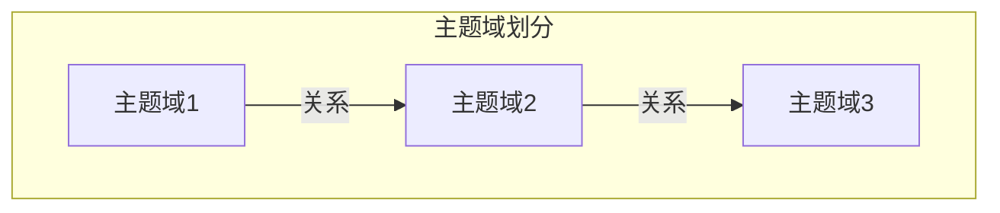
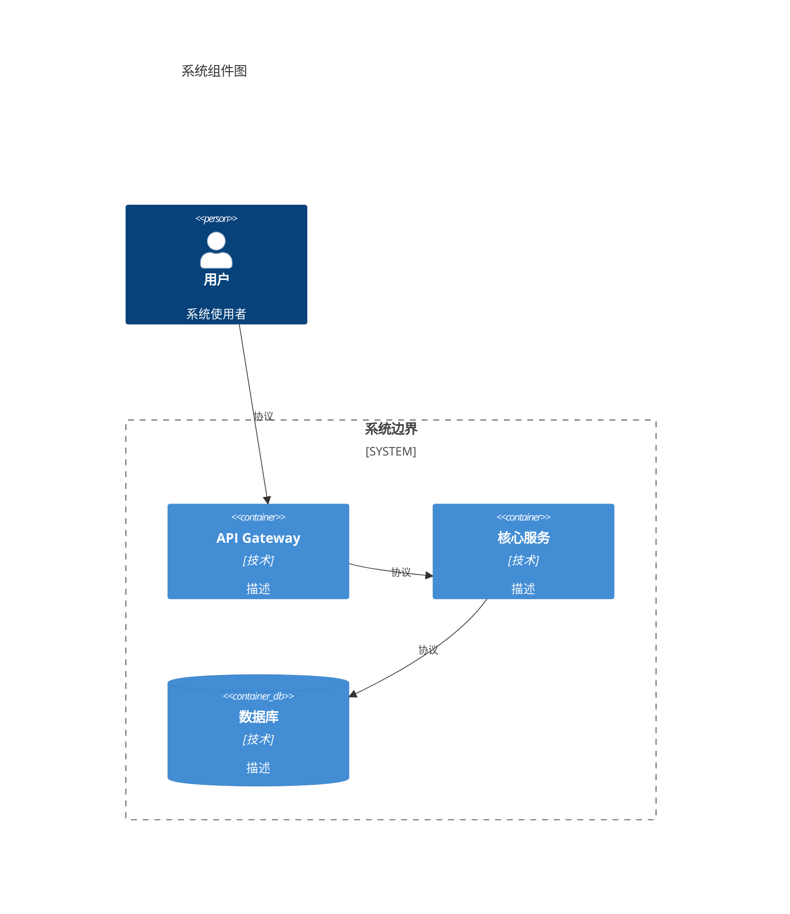
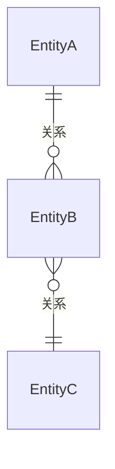
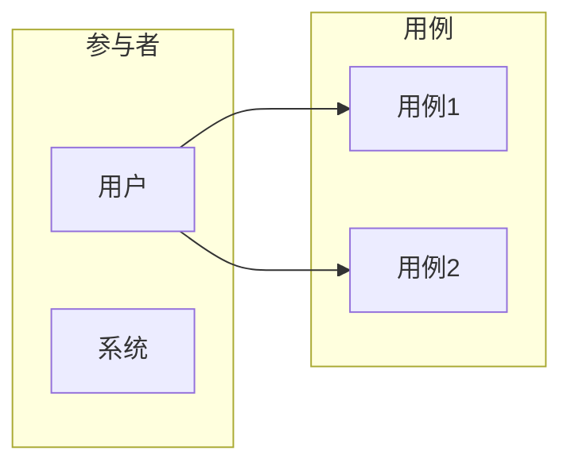
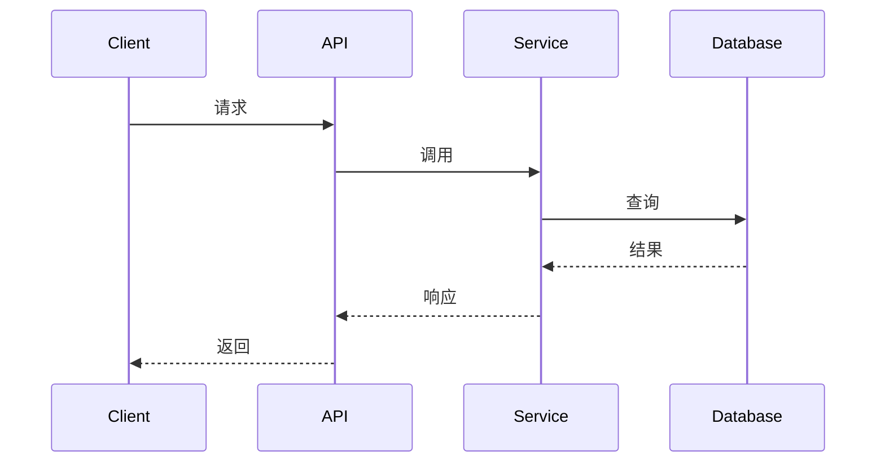

# {{project_name}} 系统设计文档

| 属性 | 值 |
|------|-----|
| **项目名称** | {{project_name}} |
| **版本** | v1.0 |
| **设计日期** | {{date}} |
| **设计深度** | {{design_depth}} |
| **作者** | {{author}} |

---

## 1. 概述

### 1.1 项目背景

{{project_background}}

### 1.2 项目目标

- 目标1
- 目标2
- 目标3

### 1.3 成功标准

- 标准1
- 标准2

### 1.4 主题域划分

| 主题域 | 职责 | 核心实体 |
|--------|------|----------|
| | | |

---

## 2. 需求概要

### 2.1 业务事件

| 主题域 | 事件名称 | 触发者 | 类型 | 频率 |
|--------|----------|--------|------|------|
| | | | | |

### 2.2 报表与管控点

| 报表/管控点 | 用途 | 使用者 | 更新频率 |
|-------------|------|--------|----------|
| | | | |

### 2.3 规模与约束

#### 性能需求

| 指标 | 要求 |
|------|------|
| 响应时间 | |
| 吞吐量 | |
| 并发量 | |

#### 技术约束

| 约束类型 | 内容 |
|----------|------|
| 语言/框架 | |
| 基础设施 | |
| 现有系统 | |

---

## 3. 架构设计

### 3.1 代码库分析

（如为增量设计）

| 属性 | 值 |
|------|-----|
| 项目路径 | |
| 主要语言 | |
| 框架版本 | |

### 3.2 组件图

### 3.3 架构决策记录

#### 决策1: {{decision_title}}

| 决策 | 选择 | 理由 |
|------|------|------|
| | | |

（详细ADR见附录）

---

## 4. 数据模型

### 4.1 领域模型

| 实体 | 描述 | 所属主题域 |
|------|------|-----------|
| | | |

### 4.2 ER图

### 4.3 实体映射表

（如为增量设计）

| 需求实体 | 现有类名 | 文件路径 | 状态 |
|----------|----------|----------|------|
| | | | |

---

## 5. 接口设计

### 5.1 用例模型

### 5.2 服务接口签名

#### {{ServiceName}}

**类名**: `{{ServiceName}}` | **类型**: Interface | **模块**: `{{module}}`

| 方法 | 描述 | 参数 | 返回 | 异常 | 幂等 |
|------|------|------|------|------|------|
| | | | | | |

### 5.3 实体/DTO设计

#### 实体类

| 类名 | 属性 | 方法 |
|------|------|------|
| | | |

#### DTO

| DTO | 用途 | 字段 |
|-----|------|------|
| | | |

### 5.4 核心流程（序列图）

---

## 6. 扩展规划

### 6.1 扩展点清单

| 扩展点 | 类型 | 位置 | 用途 |
|--------|------|------|------|
| | | | |

### 6.2 集成策略

| 集成点 | 策略 | 说明 |
|--------|------|------|
| | | |

### 6.3 降级策略

| 功能 | 类型 | 降级方案 |
|------|------|----------|
| | 核心 | 不降级 |
| | 可选 | |

---

## 7. 实现指南

### 7.1 文件变更清单

#### 新增文件

| 文件路径 | 说明 |
|----------|------|
| | |

#### 修改文件

| 文件路径 | 修改内容 |
|----------|----------|
| | |

### 7.2 实现顺序

1. 第一阶段：数据模型
2. 第二阶段：服务层
3. 第三阶段：API层
4. 第四阶段：集成测试

### 7.3 权衡与风险

| 决策 | 选择 | 优点 | 缺点 | 风险 |
|------|------|------|------|------|
| | | | | |

---

## 附录

### A. 术语表

| 术语 | 定义 |
|------|------|
| | |

### B. 详细架构决策

（完整的架构决策记录）

### C. 参考资料

- 参考链接1
- 参考链接2
