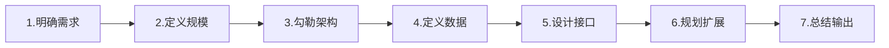
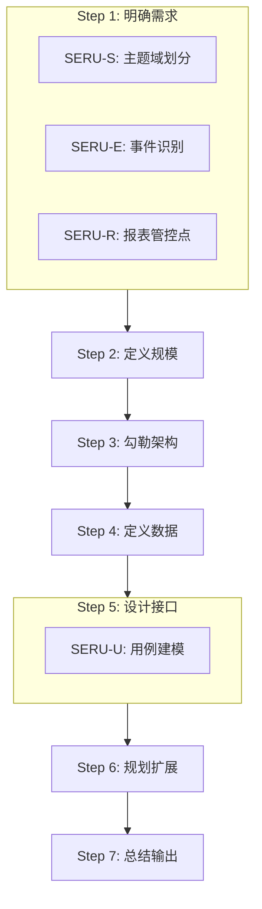
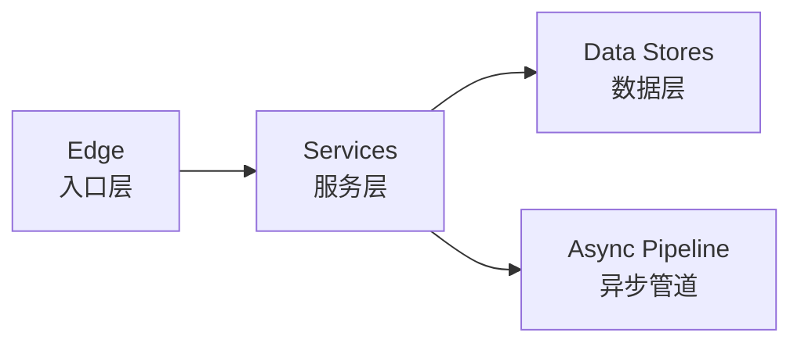

# 系统设计方法论概述

本技能融合**系统设计7步法**和**SERU分析方法论**，形成一套完整的从需求到设计的系统化流程。

## 方法论来源

### 系统设计7步法

源自业界最佳实践，适用于系统架构设计：

| 步骤 | 英文 | 核心问题 |
|------|------|----------|
| 1 | Clarify Requirements | 系统要做什么？ |
| 2 | Define Scale | 规模和约束是什么？ |
| 3 | Outline Architecture | 整体架构怎么设计？ |
| 4 | Define Data Models | 数据模型是什么？ |
| 5 | Design Components/APIs | 接口怎么设计？ |
| 6 | Plan Scaling | 如何扩展？ |
| 7 | Summarize Trade-offs | 权衡和风险是什么？ |

### SERU分析方法论

提供系统化的需求分析框架：

| 维度 | 含义 | 作用 |
|------|------|------|
| **S** | Subject Area（主题域） | 按业务职责划分系统边界 |
| **E** | Event（事件） | 识别触发系统的业务事件 |
| **R** | Report/Control（报表/管控点） | 标示系统输出和监控点 |
| **U** | Use Case（用例） | 描述用户交互场景 |

## 方法论融合

将SERU嵌入7步法的对应步骤：

## 核心设计原则

### 1. 叙事化设计（Narrative Approach）

将架构描述为一个故事，按数据流顺序叙述：

### 2. 从简单开始，随约束演进

- 提出满足当前需求的**最简基线架构**
- 仅在遇到具体约束时才添加组件
- 避免过早引入复杂结构

### 3. ADR风格决策

记录每个关键决策：
- 列出可选方案
- 做出选择
- 阐述理由
- 承认风险

### 4. 核心与可选分离

- **核心功能**：必须保持可用，不降级
- **可选功能**：可降级，有备选方案

### 5. 数据所有权

- 每个数据项只有一个写入者
- 使用API处理同步需求
- 使用事件处理异步解耦

## 产出文档规范

### 图表输出

产出的设计文档中，所有图表**必须使用Mermaid**：

- 流程图：`flowchart`
- 序列图：`sequenceDiagram`
- ER图：`erDiagram`
- C4图：`C4Container`
- 类图：`classDiagram`

### 接口签名

使用Markdown表格格式：

| 方法 | 描述 | 参数 | 返回 | 异常 | 幂等 |
|------|------|------|------|------|------|

### 文档结构

最终输出的系统设计文档包含7个部分，与7步法一一对应。

## 参考资料

- [SERU-S: 主题域划分](seru/subject-area.md)
- [SERU-E: 事件识别](seru/event-report.md)
- [SERU-R: 管控点](seru/control-point.md)
- [SERU-U: 用例建模](seru/usecase.md)
- [7步法详解](system-design/seven-steps.md)
- [C4模型说明](system-design/c4-model.md)
- [ADR编写指南](system-design/adr-guide.md)
