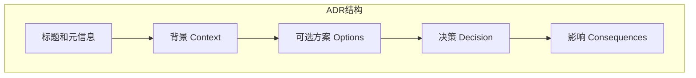
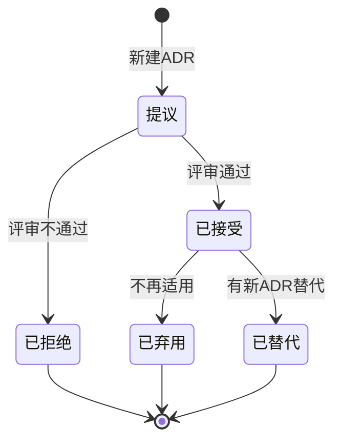

# ADR（架构决策记录）编写指南

## 什么是ADR

ADR（Architecture Decision Record）是一种记录重要架构决策的文档格式。每个ADR描述一个特定的架构决策，包括背景、可选方案、决策和影响。

## 为什么需要ADR

1. **知识传承**：新成员可以快速了解架构演进历史
2. **决策追溯**：出问题时可以回溯当时的决策理由
3. **避免重复讨论**：记录已讨论过的方案，避免反复讨论
4. **促进思考**：写作过程促使更深入的思考

## ADR结构



### 1. 标题和元信息

```markdown
# ADR-001: 选择PostgreSQL作为主数据库

| 属性 | 值 |
|------|-----|
| 状态 | 已接受 |
| 日期 | 2024-01-15 |
| 决策者 | 架构组 |
```

### 2. 背景（Context）

描述导致此决策的背景：

- 当前面临什么问题？
- 有哪些约束条件？
- 为什么需要做出决策？

```markdown
### 背景

我们正在设计一个新的订单系统，需要选择主数据库。
系统预计处理每日100万订单，需要支持复杂查询和事务。
团队对PostgreSQL和MySQL都有经验。
```

### 3. 可选方案（Options）

列出考虑过的所有方案：

```markdown
### 可选方案

#### 方案1: PostgreSQL

**优点**：
- 强大的ACID事务支持
- 丰富的数据类型（JSON、数组）
- 优秀的扩展性

**缺点**：
- 配置相对复杂
- 某些场景性能略低于MySQL

#### 方案2: MySQL

**优点**：
- 配置简单
- 社区资源丰富
- 读性能优秀

**缺点**：
- JSON支持较弱
- 事务隔离级别默认较低
```

### 4. 决策（Decision）

明确选择的方案和理由：

```markdown
### 决策

**选择方案1: PostgreSQL**

**理由**：
1. 订单系统需要强事务支持，PostgreSQL的ACID保证更可靠
2. 需要存储复杂的订单明细（JSON），PostgreSQL原生支持好
3. 团队有丰富的PostgreSQL运维经验
```

### 5. 影响（Consequences）

记录决策的影响：

```markdown
### 影响

**正面影响**：
- 事务一致性得到保证
- 可以灵活存储JSON数据
- 便于后续扩展

**负面影响**：
- 需要学习PostgreSQL特有的优化技巧
- 运维复杂度略高于MySQL

**风险**：
- 数据量超过预期时可能需要分库
- 缓解措施：提前规划分库分表方案
```

---

## ADR状态流转



| 状态 | 说明 |
|------|------|
| 提议 | 新创建，待评审 |
| 已接受 | 评审通过，正在执行 |
| 已拒绝 | 评审不通过 |
| 已弃用 | 曾经接受，现在不再适用 |
| 已替代 | 被新的ADR替代 |

---

## 最佳实践

### DO

- **及时记录**：做决策时立即记录，而非事后补充
- **简洁明了**：每个ADR只记录一个决策
- **承认缺点**：诚实列出所选方案的缺点
- **记录替代方案**：列出考虑过但未选择的方案
- **关联上下文**：引用相关的需求、ADR

### DON'T

- **不要事后美化**：不要把失败的决策改成成功的
- **不要过于冗长**：一个ADR不超过2页
- **不要遗漏风险**：必须记录已知风险和缓解措施
- **不要忘记更新**：状态变化时及时更新

---

## 模板

```markdown
# ADR-{{序号}}: {{标题}}

| 属性 | 值 |
|------|-----|
| 状态 | 提议 / 已接受 / 已弃用 / 已替代 |
| 日期 | YYYY-MM-DD |
| 决策者 | 姓名/团队 |
| 关联ADR | ADR-xxx（如有） |

## 背景

描述问题和约束...

## 可选方案

### 方案1: XXX

**优点**：
- ...

**缺点**：
- ...

### 方案2: XXX

...

## 决策

选择方案X，理由：
1. ...
2. ...

## 影响

**正面**：
- ...

**负面**：
- ...

**风险**：
- ...
```

---

## 在本技能中的应用

ADR主要在 **Step 3: 勾勒架构** 中使用，记录以下类型的决策：

| 决策类型 | 示例 |
|----------|------|
| 技术选型 | 数据库、缓存、消息队列 |
| 架构风格 | 单体/微服务、同步/异步 |
| 通信协议 | REST/gRPC、HTTP/WebSocket |
| 数据策略 | 分库分表、读写分离 |
| 安全策略 | 认证方式、加密方案 |
