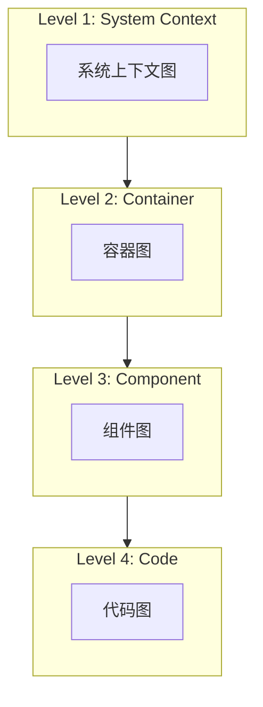
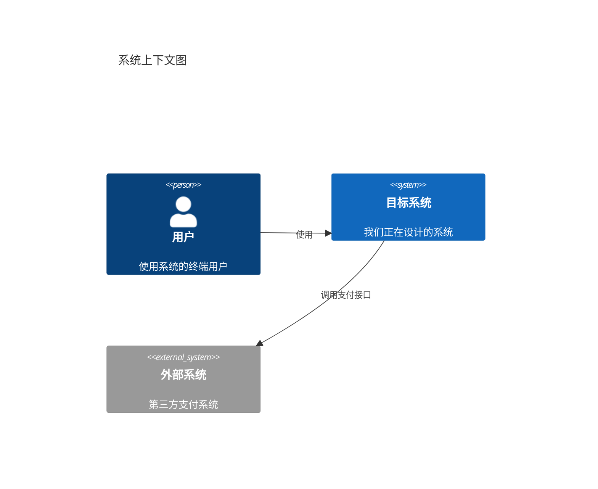
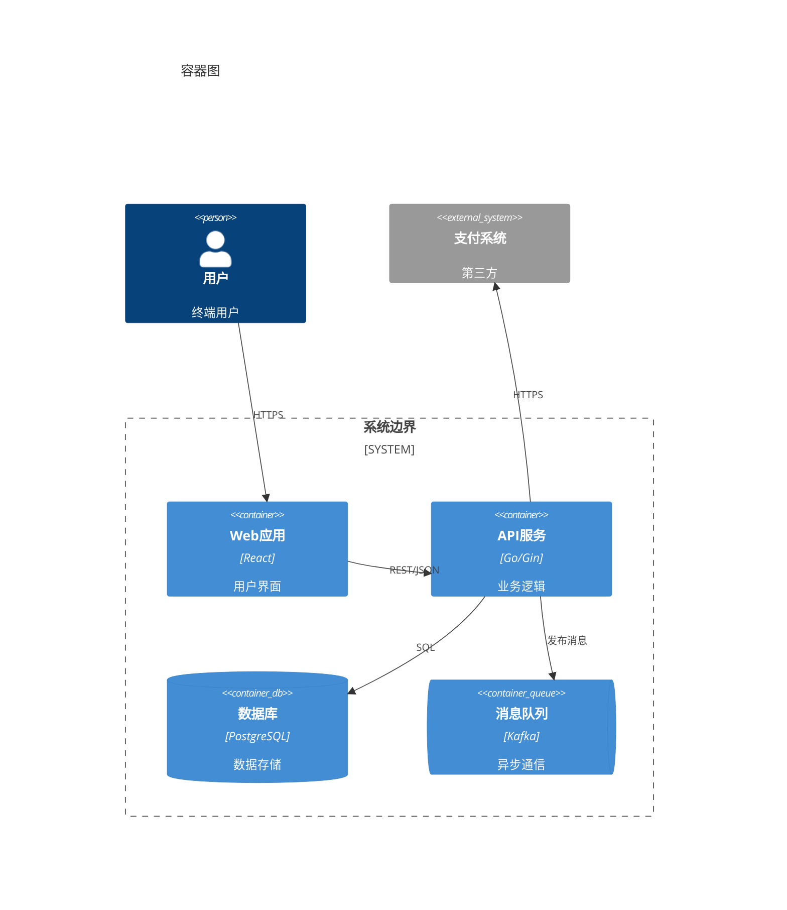
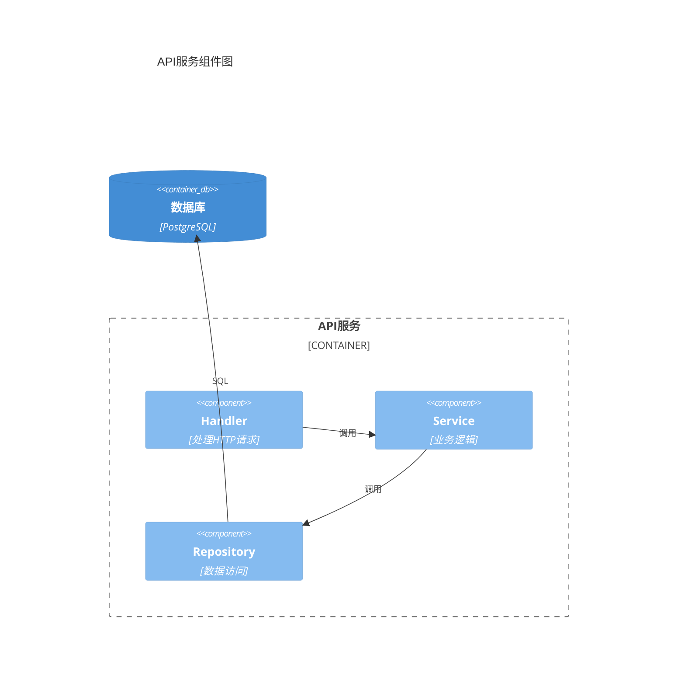
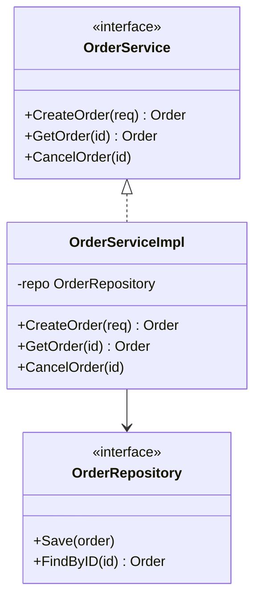

# C4模型说明

## 概述

C4模型是一种用于可视化软件架构的方法，由Simon Brown提出。C4代表四个抽象层次：Context、Container、Component、Code。



## Level 1: System Context（系统上下文）

### 目的

展示系统与外部实体（用户、外部系统）的关系，回答"系统与什么交互？"

### 元素

| 元素 | 说明 |
|------|------|
| Person | 使用系统的人员 |
| Software System | 被设计的系统 |
| External System | 外部依赖系统 |

### 示例



---

## Level 2: Container（容器）

### 目的

展示系统内部的主要技术组件，回答"系统由什么构成？"

### 元素

| 元素 | 说明 |
|------|------|
| Container | 可独立部署的单元（应用、服务、数据库） |
| Person | 使用者 |
| External System | 外部系统 |

### 示例



---

## Level 3: Component（组件）

### 目的

展示容器内部的组件结构，回答"容器内部如何组织？"

### 元素

| 元素 | 说明 |
|------|------|
| Component | 容器内的逻辑组件（模块、类组） |

### 示例



---

## Level 4: Code（代码）

### 目的

展示组件的代码级结构，回答"代码如何组织？"

### 元素

使用UML类图或其他代码级图表。

### 示例



---

## 在本技能中的应用

| C4层次 | 对应步骤 | 使用场景 |
|--------|----------|----------|
| Context | Step 1 | 展示系统边界和外部交互 |
| Container | Step 3 | 展示组件划分和通信 |
| Component | Step 5 | 展示服务内部结构 |
| Code | Step 5 | 展示类和接口关系 |

---

## Mermaid语法

### C4Context

```
C4Context
    Person(alias, "label", "description")
    System(alias, "label", "description")
    System_Ext(alias, "label", "description")
    Rel(from, to, "label")
```

### C4Container

```
C4Container
    Container(alias, "label", "technology", "description")
    ContainerDb(alias, "label", "technology", "description")
    ContainerQueue(alias, "label", "technology", "description")
    System_Boundary(alias, "label") { ... }
```

### C4Component

```
C4Component
    Component(alias, "label", "description")
    Container_Boundary(alias, "label") { ... }
```

---

## 最佳实践

1. **由粗到细**：从Context开始，逐层深入
2. **保持简洁**：每张图的元素不超过20个
3. **统一风格**：使用一致的命名和描述格式
4. **关注受众**：不同层次面向不同读者
5. **及时更新**：架构变更时同步更新图表
