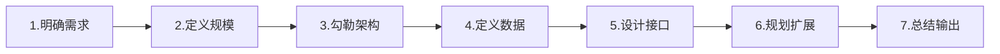
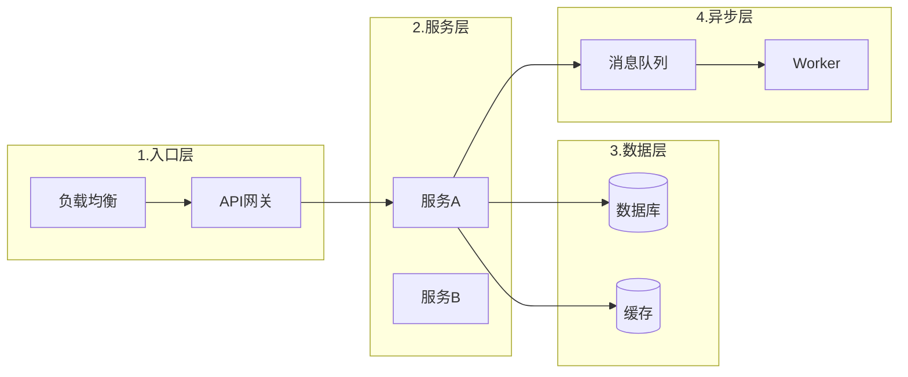

# 系统设计7步法详解

## 概述

系统设计7步法是一套结构化的系统设计流程，源自业界最佳实践，适用于从需求到技术方案的全过程。



## Step 1: 明确需求（Clarify Requirements）

### 核心问题

- 系统要解决什么问题？
- 用户是谁？
- 核心功能是什么？
- 系统边界在哪里？

### 关键活动

1. **功能需求澄清**
   - 核心功能 vs 可选功能
   - 用户场景梳理
   - 输入输出定义

2. **非功能需求识别**
   - 性能要求
   - 可用性要求
   - 安全要求

### 输出物

- 功能清单
- 用户场景
- 系统边界图

---

## Step 2: 定义规模（Define Scale）

### 核心问题

- 系统需要支持多大的规模？
- 有哪些技术约束？
- 质量要求是什么？

### 关键指标

| 类型 | 指标 | 示例 |
|------|------|------|
| 性能 | QPS、响应时间、并发量 | 1000 QPS, p99 < 200ms |
| 数据 | 数据量、增长率 | 100万记录, 日增1万 |
| 可用性 | SLA、RTO、RPO | 99.9%, RTO < 1h |

### 估算方法

```
日活用户 × 人均操作次数 ÷ 86400 = 平均QPS
平均QPS × 峰值系数(3-10) = 峰值QPS
```

---

## Step 3: 勾勒架构（Outline Architecture）

### 核心问题

- 系统由哪些组件构成？
- 组件之间如何通信？
- 数据如何流动？

### 架构叙事顺序



### 设计原则

1. **从简单开始**：先设计最简可行方案
2. **随约束演进**：遇到具体问题再添加组件
3. **关注数据流**：按数据流动顺序叙述

---

## Step 4: 定义数据模型（Define Data Models）

### 核心问题

- 系统处理哪些数据？
- 数据之间的关系是什么？
- 谁拥有数据的写入权？

### 建模步骤

1. **识别实体**：从业务事件中提取名词
2. **定义属性**：每个实体3-5个核心属性
3. **建立关系**：1:1、1:N、M:N
4. **明确所有权**：每个实体一个写入者

### 输出物

- 实体清单
- ER图（Mermaid）
- 所有权矩阵

---

## Step 5: 设计组件与接口（Design Components/APIs）

### 核心问题

- 每个组件提供什么接口？
- 接口的输入输出是什么？
- 核心流程如何实现？

### 接口设计要素

| 要素 | 说明 |
|------|------|
| 方法名 | 动词+名词，如 `CreateOrder` |
| 参数 | 类型、必填性、校验规则 |
| 返回值 | 成功响应、错误响应 |
| 异常 | 异常类型、触发条件 |
| 幂等性 | 是否幂等 |

### 流程设计

使用序列图展示核心用例的实现流程。

---

## Step 6: 规划扩展（Plan Scaling）

### 核心问题

- 如何应对流量增长？
- 如何与现有系统集成？
- 故障时如何降级？

### 扩展策略

| 策略 | 场景 | 方法 |
|------|------|------|
| 水平扩展 | 计算能力不足 | 加机器、无状态设计 |
| 垂直扩展 | 单机性能不足 | 升配置 |
| 数据分片 | 数据量过大 | 分库分表 |
| 缓存 | 读多写少 | Redis/Memcached |

### 降级策略

- **核心功能**：不降级，保证可用
- **可选功能**：可降级，返回默认值或缓存

---

## Step 7: 总结与输出（Summarize Trade-offs）

### 核心问题

- 设计中有哪些权衡？
- 有哪些风险？
- 如何实现？

### 权衡记录

| 决策点 | 选项A | 选项B | 选择 | 理由 |
|--------|-------|-------|------|------|
| | | | | |

### 输出物

- 系统设计文档
- 架构决策记录（ADR）
- 实现指南

---

## 最佳实践

### DO

- ✅ 先问清楚需求再设计
- ✅ 从简单方案开始
- ✅ 用数据支撑决策
- ✅ 记录设计权衡
- ✅ 画图说明架构

### DON'T

- ❌ 过早优化
- ❌ 过度设计
- ❌ 忽略约束条件
- ❌ 只考虑理想情况
- ❌ 不记录决策理由
